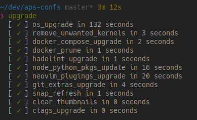

Dotfiles are currently highly unstable as I am still migrating to macOS.
Most of the stuff here must be needed to be removed.

# dotfiles

All applications configurations ever used

## Content (roughly)

- VIM configuration
- ZSH configuration
- custom binaries
- pyenv setup
  - all of the plugins controlled via [.gitmodules](./.gitmodules)
  - installation of leading `Python` versions inside [here](./install#L162)
- nodenv setup
  - all of the plugins controlled via [.gitmodules](./.gitmodules)
  - installation of leading `Node` versions inside [here](./install#L162)
- goenv setup
  - all of the plugins controlled via [.gitmodules](./.gitmodules)
  - installation of leading `Go` versions inside [here](./install#L162)
- ctags setup
  - automatic build from [this](https://github.com/universal-ctags/ctags) that takes place
    [here](./.installer/install_ctags.sh)
- docker & docker-compose
- major browsers
  - Firefox
  - Google Chrome
  - Brave :+1:

## Most notable

### Awesome upgrade binary

- upgrades system packages along with clean up
- executes `purge-old-kernels`, what do I need old kernels for?
- upgrades `docker-compose` if there's a never version available
- cleans up docker artifacts, but only those that are old enough
- upgrades `node` and `Python` "system" wide packages
  - actually I do not use native Python and node, there is `nodenv` and `pyenv` magic beneath
- upgrades my `Neovim` plugins, removes old one and install those that were added previously (if needed)
- upgrades `git-extras`
- refreshes all `snap`
- removes thumbnails that I create when I need to find something without shell
- upgrades `ctags` that I built myself for these dotfiles
  - version is kept inside [local git](./gitconfig#L19) configuration (sneaky)

### CI system

My dotfiles are evaluated in the CI system that ensures me that, if needed, I will be able to
deploy them in the fresh system without having too much to worry about.

## Inspirations / credits

- [SSH Compression](https://www.gidblog.com/enable-compression-for-ssh/)
